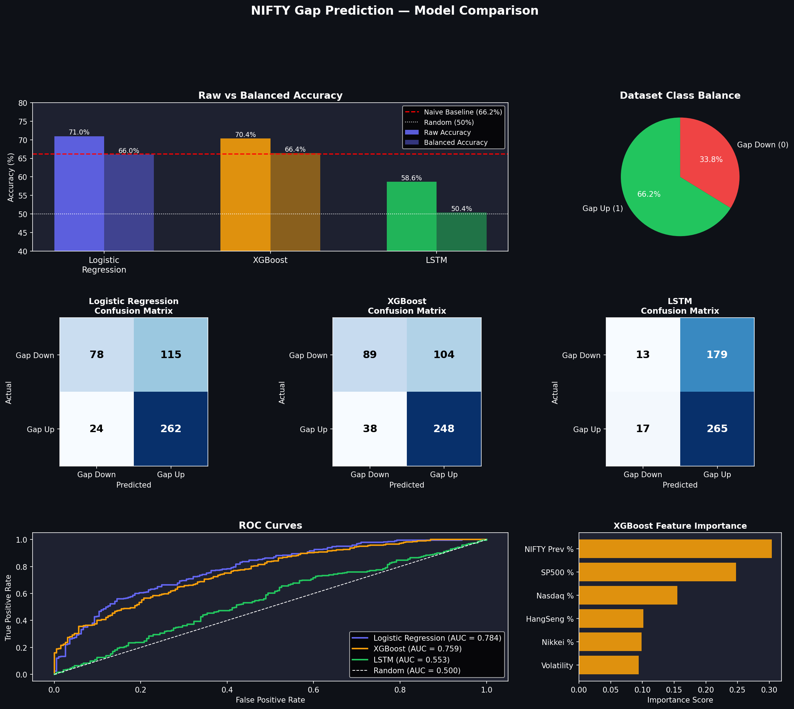

# NIFTY Gap Prediction — ML vs LSTM

Predicting the **next-day opening gap direction** of the NIFTY 50 using global market signals.
This project evaluates whether **global indices contain predictive information for NIFTY opening gaps** and compares **classical machine learning models vs deep learning (LSTM)**.

---

## Project Motivation

Financial markets are often considered **efficient**, meaning new information is rapidly incorporated into prices.

This project explores:

> Do global market movements contain predictive signals for the next-day NIFTY opening gap?

Specifically, we test whether movements in major global indices such as S&P 500, NASDAQ Composite, Nikkei 225, and Hang Seng Index can help predict whether NIFTY opens **Gap Up or Gap Down**.

---

## Dataset

Historical market data (2015–2026) from Yahoo Finance via `yfinance`.
**2,394 rows** after cleaning.

### Target Variable

```
Gap % = (Open - Previous Close) / Previous Close
Target = 1 → Gap Up  |  Target = 0 → Gap Down
```

### Features

| Feature | Description | Shift |
|---|---|---|
| SP500 % | S&P 500 daily return | shift(1) |
| Nasdaq % | NASDAQ daily return | shift(1) |
| Nikkei % | Nikkei 225 daily return | shift(1) |
| HangSeng % | Hang Seng daily return | shift(1) |
| NIFTY Prev % | Previous day NIFTY return | — |
| Volatility | 5-day rolling std of NIFTY returns | — |

All global indices use `shift(1)` — dataset index is NIFTY dates, so previous trading day's close is used to avoid **calendar mismatch and data leakage**.

---

## Pipeline

```
Dataset (CSV) → Time-based 80/20 Split → Train 3 Models → Evaluate → Ensemble Prediction
```

### Train-Test Split
Time-based split (no shuffling):
- Train: 2015 → 2023 (1,915 rows)
- Test:  2024 → 2026 (479 rows)

### Models

| Model | Type | Why |
|---|---|---|
| Logistic Regression | Linear baseline | Interpretable, fast |
| XGBoost | Gradient Boosting | Best for tabular data, nonlinear patterns |
| LSTM | Deep Learning | Temporal sequence memory (5-day window) |

### Ensemble
```
P(UP) = 0.20 × LR + 0.50 × XGB + 0.30 × LSTM
```

---

## Results

Due to **class imbalance (~66% Gap Up days)**, raw accuracy is misleading. Balanced accuracy is the primary metric.

| Model | Accuracy | Balanced Accuracy | Naive Baseline |
|---|---|---|---|
| Logistic Regression | 70.98% | 66.01% | 66.21% |
| XGBoost | 70.35% | 66.41% | 66.21% |
| LSTM | 58.65% | 50.37% | 66.21% |



---

## Key Findings

**1. Weak but real predictive signal**
Global market returns contain limited but detectable predictive power. Balanced accuracy is marginally above the naive baseline for ML models.

**2. ML outperforms Deep Learning**
Classical models outperform LSTM due to limited dataset size (~2,400 samples), tabular feature structure, and weak temporal dependencies.

**3. LSTM is essentially random**
At 50.37% balanced accuracy, LSTM performs no better than a coin flip — confirming that dataset size is too small for deep learning to find meaningful temporal patterns.

**4. Honest evaluation matters**
Raw accuracy of ~71% looks impressive but is inflated by class imbalance. Balanced accuracy exposes the true signal strength.

---

## Project Structure

```
nifty-gap-prediction/
├── data/
│   └── nifty_gap_dataset_v2.csv   # pre-built dataset (2015–2026)
├── figures/
│   └── model_comparison.png       # accuracy, confusion matrices, ROC, feature importance
├── models_saved/                  # trained models (auto-created, gitignored)
├── scripts/
│   └── generate_dataset.py        # one-off script to regenerate dataset
├── src/
│   ├── models/
│   │   ├── logistic_model.py
│   │   ├── xgboost_model.py
│   │   ├── lstm_model.py
│   │   └── ensemble.py
│   └── utils/
│       └── features.py            # dataset loader + train/test split
├── .streamlit/
│   └── config.toml
├── app.py                         # Streamlit UI
├── train.py                       # standalone training script
├── visualize.py                   # generates figures
└── requirements.txt
```

---

## Setup

```bash
pip install -r requirements.txt
```

Train all models:
```bash
python train.py
```

Generate figures:
```bash
python visualize.py
```


---

## Future Improvements

- Include macro indicators (VIX, DXY, crude oil)
- Use intraday Asian market signals (pre-open snapshot)
- Add news sentiment features (FinBERT)
- Apply walk-forward validation

---

## Conclusion

> Global indices contain very weak predictive information for NIFTY opening gaps. Classical ML models slightly outperform deep learning on small tabular financial datasets. Proper evaluation metrics are essential — raw accuracy is misleading when class imbalance exists.

---

